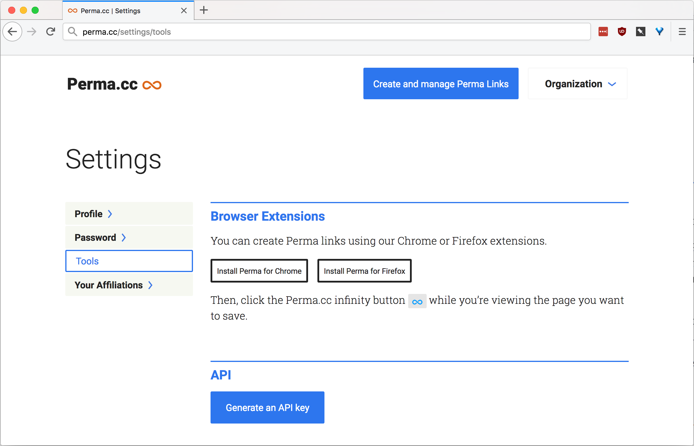

# Downloading the program

Please click the link based on your operating system.

[MacOS](https://github.com/amastis/Law-Review/releases/download/v1.0.0/MacOS.-.Permanent_Linker.zip)

Windows: Not available currently.

# How to get your API Key from [Perma.cc](https://perma.cc/docs/developer)
1. Login to Perma.cc and navigate to the [Setting's Tools page](https://perma.cc/settings/tools)
- The page should look like the following:

  

2. Click the *`Generate an API key`* button, and use the string of characters that are generated in Step 4 below.

# How to use the program
1. After downloading the program for your operating system, unzip the file (click on the downloaded file), and open the program (click on the `Permanent Linker` file in your `Downloads` folder).
1. Allow the program to access your `Downloads` folder, this is where the output will be saved.

  

3. Click upload to insert in the Word document to scan for links (make sure that document has all of the citations in footnotes and that there are no endnotes in the document).
1. Insert your API Key (see above on how to get your API Key) into the API Key text input box.
1. Then click `Generate Excel` to generate the Excel file based on the word document that you selected.
- Note: while there is a loading screen that pops up, it should only take approximately 1 second per link found in the Word document.
1. Once the program is finished there will be a popup to let you know that it is finished, the output will have been downloaded to your `Downloads` folder. Clicking `Ok` on the popup will take you back to Step 3 if you would like to upload a different document to generate permanent links for website articles.

# Modifying the program 
Check out the `src` folder in this directory, which has the files and instructions on building the executable file used for this project.
